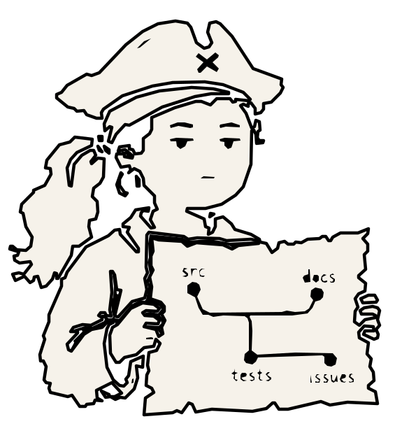

# ProjectAtlas Desktop

Source code of **ProjectAtlas Desktop** — a Windows companion app for
[ProjectAtlas](https://github.com/styler-ai/ProjectAtlas), the local code map
(SQLite) for AI coding agents. Atlas indexes folders, files, and symbols so
agents read exactly the right places instead of searching broadly, saving a
lot of tokens and time.

ProjectAtlas is Rust-native, high-performance local repository intelligence: a persistent SQLite map,
a native Rust CLI and MCP server, with purposes that identify the responsible area, graph relationships
that reveal connected code, compact summaries and outlines, and exact source slices that provide the final evidence.


Weitere technische Einstiege: [Runtime installation and repair](docs/agent-integration.md#runtime-installation-and-repair),
[Token reporting and human TUI](docs/agent-integration.md#token-reporting-and-human-tui),
[MCP tool sequence](docs/agent-integration.md#mcp-tool-sequence).

Für die Erstverteilung: `codex plugin add projectatlas --marketplace projectatlas`.

Every file not opened. Every folder not explored. ProjectAtlas guides coding agents with purpose metadata and an intelligent code graph, reducing token costs by over 90%.

The "over 90%" figure is a workload-specific local estimate from the published audit, not a universal savings guarantee or provider-billing result; see [One Large-Application Audit](#one-large-application-audit).

Human-readable token view: `projectatlas token --view tui` (see `docs/assets/token-impact-tui.png`).

The desktop app shows how many tokens ProjectAtlas has saved in your local
projects — what, when, where, and by what means — and connects projects to
the AI tools Claude Code, Codex, and OpenCode at the click of a button.

## Credits

This repository is a fork of
[styler-ai/ProjectAtlas](https://github.com/styler-ai/ProjectAtlas). All props
for ProjectAtlas itself go to the original creator — the desktop app in
`crates/projectatlas-desktop` is the main addition here.

This is my second project, so please be lenient :) Contributions and feedback
are welcome.

## Downloads

Finished installers and update manifests live in
[projectatlas-desktop-releases](https://github.com/einzigTimo/projectatlas-desktop-releases).

Für die Weitergabe an Kolleg:innen gilt die kurze
[Windows-Installations- und Ersteinrichtungsanleitung](docs/kolleginnen-installation.md).
Die veröffentlichte Referenz ist an den Release-Tag `releases/tag/v0.4.5-rc3` gebunden.
Die RC-Ausgabe liegt unter `docs/v0.4.5-rc3-release-notes.md`, wird als prerelease veröffentlicht
und ersetzt nicht den vorherigen stabilen GitHub-Latest-Release.
The candidate is published as a prerelease and does not replace the preceding stable GitHub Latest release.
Für task-orientierten Agentenstart wird einmalig `atlas_session_brief` mit `compact: true` aufgerufen;
danach folgt direkt der typisierte nächste Aufruf.
Nur eine produktiv freigegebene, Windows-Authenticode-signierte Ausgabe ist dafür vorgesehen;
ein lokaler Probebau ist kein verteilbarer Installer.

## Building the desktop app

Prerequisites: Rust toolchain (see `rust-toolchain.toml`), `cargo tauri`
(Tauri CLI), Windows.

A local developer build without publishing and without a Tauri updater key:

```powershell
pwsh ./.github/scripts/invoke-desktop-release.ps1 -Version <version> -AllowUnsignedUpdater
```

See the script header in
[`.github/scripts/invoke-desktop-release.ps1`](.github/scripts/invoke-desktop-release.ps1)
for the full release flow.

## Signaturen und produktive Ausgaben

Die beiden Signaturen lösen unterschiedliche Aufgaben und sind nicht austauschbar:

- `TAURI_SIGNING_PRIVATE_KEY` bzw. `TAURI_SIGNING_PRIVATE_KEY_PATH` erzeugt die
  Tauri-Updater-Datei `.sig`. Sie schützt den automatischen Updatekanal, zeigt Windows aber
  keinen vertrauenswürdigen Herausgeber an. Vor jedem Upload prüft der Wrapper die `.sig`
  kryptografisch gegen den exakten Installer und den in der App eingebetteten Public Key.
- Windows Authenticode signiert Sidecar, die paketierte Haupt-EXE und den Installer über ein
  bereits im geschützten Windows-Zertifikatsspeicher vorhandenes, öffentlich vertrauenswürdiges
  Code-Signing-Zertifikat. Der Wrapper erwartet dessen Fingerprint in
  `PROJECTATLAS_AUTHENTICODE_CERTIFICATE_THUMBPRINT` und einen HTTPS-RFC-3161-Dienst in
  `PROJECTATLAS_AUTHENTICODE_TIMESTAMP_URL`. Ein selbstsigniertes Ersatzzertifikat ist nicht
  zulässig. Wenn das Windows SDK nicht automatisch gefunden wird, kann zusätzlich
  `TAURI_WINDOWS_SIGNTOOL_PATH` auf `signtool.exe` zeigen.

Ein produktiver Release läuft ausschließlich über die Develop Zentrale. Der Wrapper bricht im
Publish-Modus bei fehlender oder ungültiger Authenticode-Signatur von Sidecar oder Installer ab.
Der verwendete Zertifikatsthumbprint muss zusätzlich exakt mit dem kurzlebigen, commit- und
zielgebundenen Preflight-Artefakt der Develop Zentrale übereinstimmen und wird in der
Release-Provenienz festgehalten; eine beliebige gültige Build-Host-Signatur genügt nicht.
Das getrennte GitHub-Release-Repository muss einen bindbaren Default-Branch besitzen und
**Immutable Releases** aktiviert haben. Der Wrapper legt den Versions-Tag am zuvor geprüften
Release-Repository-Commit an, hält die Ausgabe bis zum vollständigen SHA-256-geprüften
Asset-Inventar als privaten Draft und veröffentlicht sie nur mit erneut verifiziertem Tag.
Die Signatur der tatsächlich installierten Haupt-EXE wird anschließend im verpflichtenden
Clean-System-Installations-E2E geprüft; `target/release/projectatlas-desktop.exe` ist dafür kein
Ersatz, weil Tauri diesen Build-Pfad nach dem Paketieren absichtlich unsigniert wiederherstellt.

## Repository layout

- `crates/projectatlas-desktop` — the Tauri desktop app (this fork's addition)
- `crates/*` — ProjectAtlas CLI, core, database, and services (upstream)
- `docs/`, `openspec/` — documentation and specs (upstream)

## License

MIT — see [LICENSE](LICENSE). Original work © Shaun Tyler
(styler-ai/ProjectAtlas).
